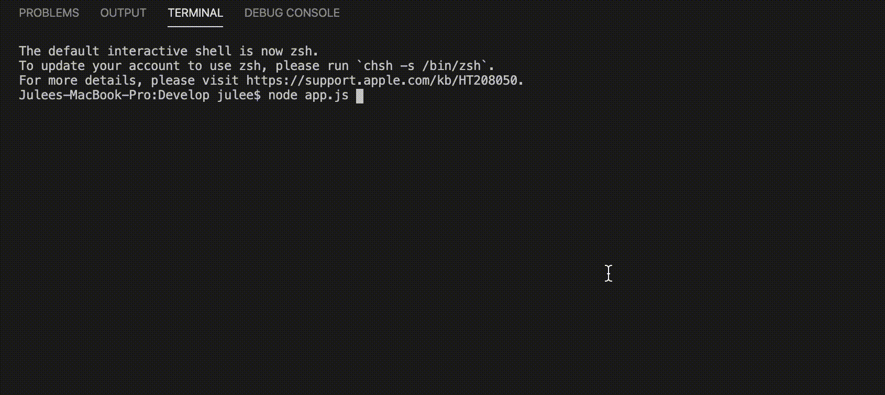
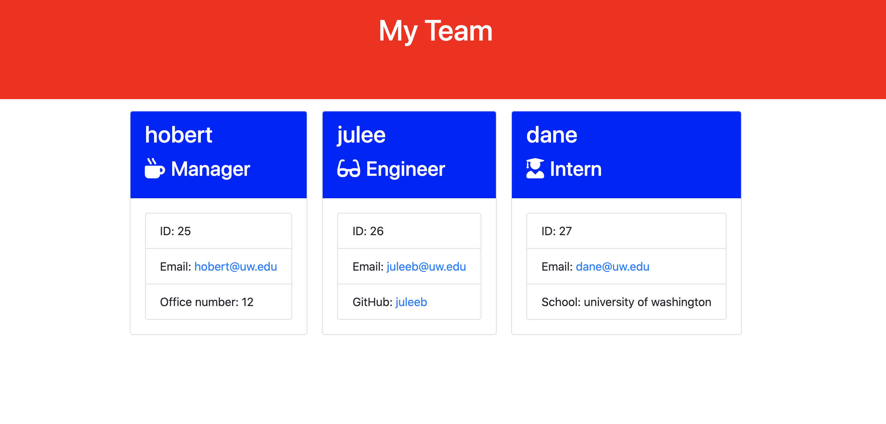

# team-profile
About the project:

Command line application for software engineering team to input manager and team member's contact infomations. 

Image preview:

Commandline Instruction

Final Page 

Description of project:

-Semantic HTML elements are used.

-Structures are in logical structures in positioning and styling.

-Bootstrap grid system used for responsive layout.

-Javascript used

-Node.js
    
    -path
    -fs

-NPM
    
    -inquirer

Test:

npm run test to - 
 develop/test/
    
    *Employee.test.js
    
    *Engineer.test.js
    
    *Intern.test.js
    
    *Manager.test.js

Deployed Link:

https://juleeb.github.io/team-profile/
